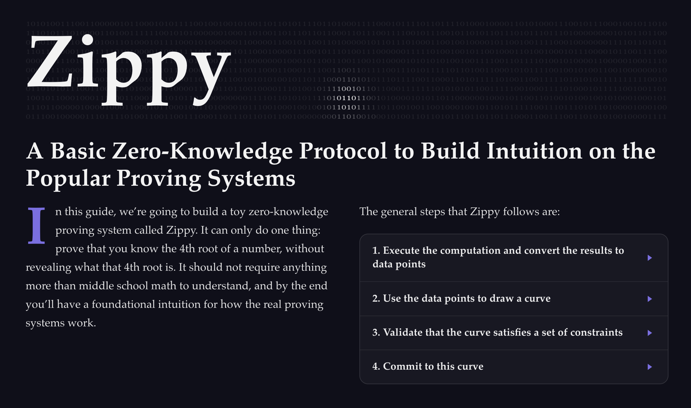

# Wurd

An AI-enabled document compiler that turns markdown files into editorial-quality HTML. Powered by [Pretext](https://github.com/chenglou/pretext) for typographic layout, [KaTeX](https://katex.org/) for math, and LLMs for AI-generated content. Implement your own plugins for unlimited versatility.

```
text.md ──→ wurd ──→ self-contained index.html
               ↑
           plugins (math, graphs, tables, citations, ...)
```

Here's an example of what Wurd can produce:

<p align="center">
  
</p>

## Quick Start

```bash
# Install dependencies
npm install

# Compile the hello-world example (no API key needed)
npx tsx src/cli.ts examples/hello-world/text.md

# Open the output
open dist/hello-world/index.html
```

## Installation

### Global CLI

```bash
# From the repo directory:
npm install -g .

# Now use it anywhere:
wurd path/to/text.md
```

### Local (npx)

```bash
npx tsx src/cli.ts path/to/text.md
```

## LLM Configuration

AI-driven plugins (graph, table) require an LLM. Create a `.env` file in the project root:

```env
LLM_API_KEY=sk-...
LLM_BASE_URL=https://api.anthropic.com/v1
LLM_MODEL=claude-opus-4-6
```

Supports any OpenAI-compatible API. Without this, deterministic plugins (math, accordion, cite, binary-stream) still work fine.

## Writing Documents

Documents are markdown files with optional frontmatter and plugin tags.

### Frontmatter

YAML-style config between `---` delimiters at the top of the file:

```markdown
---
columns: 2
columnWidth: 500
dropCap: true
accentColor: '#7c6ee6'
h1MaxFontSize: 120
headingUnderline: 'subtitle'
pointerEventsNone: 'title'
---
```

**Layout options:** `columns` (1, 2, 3, or 'auto'), `columnWidth`, `columnGap`, `maxContentWidth`, `gutter`, `narrowGutter`, `narrowBreakpoint`

**Heading options:** `h1MaxFontSize`, `h2MaxFontSize`, `h3MaxFontSize`, `h1MaxHeight`, `h2MaxHeight`, `h3MaxHeight`, `headingMinFontSize`, `headingLineHeightRatio`, `headingSpacingBelow`, `subheadingSpacingBelow`, `h1SpacingAbove`, `h2SpacingAbove`, `h3SpacingAbove`

**Spacing options:** `paragraphSpacing`, `listSpacing`, `rawSpacing`, `sectionGap`, `blockquoteSpacingAbove`, `blockquoteSpacingBelow`

**Typography:** `dropCap`, `dropCapLines`, `bodyFontSize`, `bodyLineHeight`

**Colors:** `bgColor`, `textColor`, `headingColor`, `accentColor`, `pullQuoteColor`, `pullQuoteBorderColor`, `headingUnderlineColor`

**Features:** `headingUnderline` (comma-separated element IDs), `pointerEventsNone` (comma-separated element IDs), `columnSpan` (comma-separated: 'quotes', 'graphs', 'tables', 'math'), `twoColumnMinWidth`, `threeColumnMinWidth`

**Open Graph / SEO:** `ogDescription`, `ogImage`, `ogUrl`, `ogType` (default: 'article'), `ogSiteName` — generates `<meta>` tags for link previews on social media and messaging apps.

### Plugin Tags

Inline:
```markdown
The equation [plugin:math]x^2 + 1[/plugin] is simple.
```

Block:
```markdown
[plugin:math]
\[E = mc^2\]
[/plugin]
```

With config (key: value lines before content):
```markdown
[plugin:binary-stream]
rows: 12
position: absolute
top: 80px
[/plugin]
```

### Element IDs

Tag any heading with `{#id}` to reference it in frontmatter options:

```markdown
# My Title {#title}

## Subtitle {#subtitle}
```

Then use in frontmatter:
```yaml
headingUnderline: 'subtitle'
pointerEventsNone: 'title'
```

### Blocks

Wrap content in `[block]...[/block]` to group elements that should stay together:

```markdown
[block]
Some paragraph.

[plugin:math]
\[x^2\]
[/plugin]
[/block]
```

## Built-in Plugins

| Plugin | Type | Description |
|--------|------|-------------|
| **math** | Deterministic | KaTeX math rendering. Inline or block. |
| **accordion** | Deterministic | Expandable FAQ-style sections. |
| **cite** | Deterministic | Citations with auto-numbered references. |
| **binary-stream** | Deterministic | Decorative binary digit grid with mouse glow. |
| **graph** | LLM | AI-generated SVG charts from descriptions. |
| **table** | LLM | AI-generated HTML tables from descriptions. |

### Math

```markdown
Inline: [plugin:math]x^2[/plugin]

Block:
[plugin:math]
\[E = mc^2\]
[/plugin]
```

### Accordion

```markdown
[plugin:accordion]
Question one | Answer to question one.
Question two | Answer to question two.
[/plugin]
```

### Citations

```markdown
Some fact[plugin:cite]Author, "Title", Year, https://url[/plugin].
```

Automatically generates a numbered references section at the end.

### Graph (requires LLM)

```markdown
[plugin:graph]
Plot f(x) = x^2 as a smooth blue curve.
Data points at (1,1), (2,4), (3,9) as red circles.
Title: "Quadratic Function".
[/plugin]
```

### Table (requires LLM)

```markdown
[plugin:table]
A table with columns "Name" and "Value".
Row 1: Name = Alice, Value = 42
Row 2: Name = Bob, Value = 17
[/plugin]
```

## Custom Plugins

Use `--plugins <dir>` to load plugins from an external directory:

```bash
wurd text.md --plugins ./my-plugins
```

Each plugin is either a `name/index.ts` folder or a standalone `.ts` file that default-exports a plugin object.

### Deterministic Plugin

```typescript
import type { DeterministicPlugin } from 'wurd/src/plugins.js'

const myPlugin: DeterministicPlugin = {
  name: 'my-plugin',
  mode: 'deterministic',
  render(content: string, id: string): string {
    return `<div id="${id}">${content}</div>`
  },
  assets: {
    css: `.my-class { color: red; }`,
  },
}

export default myPlugin
```

### LLM Plugin

```typescript
import type { LLMPlugin } from 'wurd/src/plugins.js'

const myPlugin: LLMPlugin = {
  name: 'my-plugin',
  mode: 'llm',
  systemPrompt: 'You generate HTML from descriptions.',
  guidelines: 'Use dark theme colors.',
  extractContent(response: string): string {
    // Parse the LLM response and return HTML
    return response
  },
}

export default myPlugin
```

### Plugin Assets

Plugins can declare CSS, head elements, and a browser-side runtime module:

```typescript
assets: {
  css: `.my-class { color: white; }`,
  headElements: ['<link rel="stylesheet" href="...">'],
  runtimeModule: join(__dirname, 'runtime.ts'),  // bundled into the page
}
```

## CLI Options

```
wurd <path-to-markdown> [options]

Options:
  --no-cache        Skip LLM response cache (re-generate all AI content)
  --plugins <dir>   Load additional plugins from directory (repeatable)
```

## Project Structure

```
src/
  cli.ts          Entry point
  parser.ts       Markdown + plugin tag parser
  plugins.ts      Plugin loader and executor
  template.ts     HTML page template
  llm.ts          LLM client with caching
  runtime/
    layout.ts     Pretext-powered editorial layout engine
    main.ts       Browser runtime entry
plugins/
  accordion/      Expandable sections
  binary-stream/  Decorative binary grid
  cite/           Citation references
  graph/          LLM-generated charts
  math/           KaTeX math
  table/          LLM-generated tables
examples/
  hello-world/    Minimal example (no LLM needed)
  zk-guide/       Full-featured article
```

## Output

The compiler produces a self-contained HTML file in `dist/<dir-name>/index.html`. Everything — CSS, JavaScript, plugin output — is inlined. No external dependencies at runtime except optional CDN links (e.g. KaTeX fonts).

## Recommended Editors

Wurd documents are just markdown files, so any editor works. A few that make the writing experience nicer:

- **VS Code** with [Rich Markdown Editor](https://marketplace.visualstudio.com/items?itemName=nicepkg.vscode-rich-markdown-editor) — WYSIWYG-style editing with live preview
- **[Typora](https://typora.io/)** — clean, distraction-free markdown editor with inline rendering
- **[iA Writer](https://ia.net/writer)** — focused writing with syntax highlighting and content blocks
- **[Obsidian](https://obsidian.md/)** — good for organizing multiple documents with wiki-style linking
